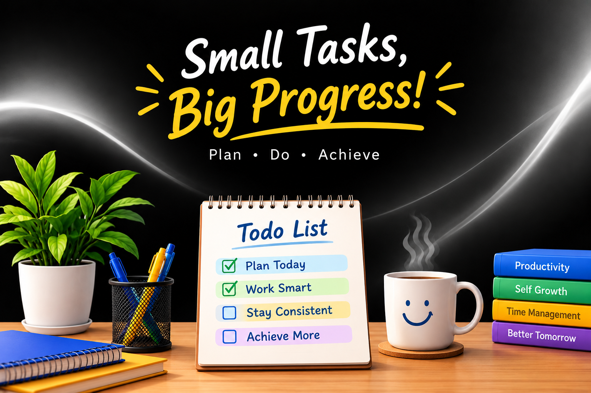

# React Todo List - ***Plan and Learn***

A simple Todo List application built with **React** and **React-Bootstrap**.

## Features

* Add new tasks
* Edit tasks
* Delete tasks
* Mark tasks as completed
* Filter tasks by All, Completed, and Incomplete
* Save tasks using localStorage
* Responsive design

## Technologies

* React
* React-Bootstrap
* JavaScript
* Bootstrap
* React Hooks

## Hooks Used

* `useState()` – Manage tasks and form state
* `useEffect()` – Save and load tasks from localStorage
* `useRef()` – Focus the input field

## Project Structure

```sh
React-TodoList
|
src/
│
├── components/
│   ├── TodoForm.jsx       → Add task
│   ├── TodoFilter.jsx     → Filter tasks
│   ├── TodoList.jsx       → Display task list
│   └── TodoItem.jsx       → Display one task
│
├── App.js                → State + main logic
├── index.js              → Bootstrap + React entry
└── index.css             → Background + Responsiveness
```

## Installation

```bash
npm install
npm start
```

Open the application at:

```text
http://localhost:3000
```



>This project is created for **learning and practicing React Hooks, state management,localStorage and React-Bootstrap**.
